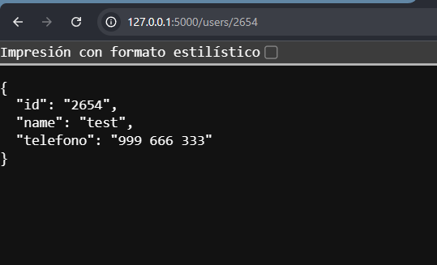
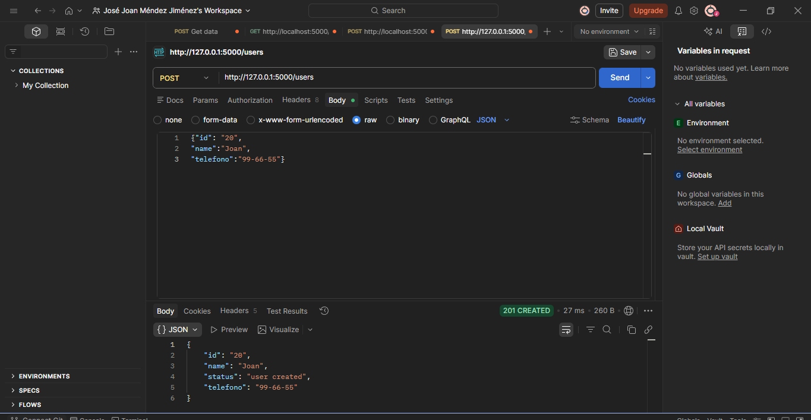

# Implementación de API con Flask

## Propósito de la actividad
Investigar, comprender y aplicar los fundamentos teóricos del desarrollo de APIs, para posteriormente implementar una API funcional utilizando el framework Flask. Esto demuestra la capacidad de consumir servicios y construir soluciones web que satisfagan necesidades reales del cliente.

## Evidencias de Ejecución

A continuación se muestran las pruebas de los métodos HTTP implementados:

### 1. Prueba del Método GET (Navegador)
Al acceder a la ruta de un usuario específico, la API devuelve los datos en formato JSON

### 2. Prueba del Método POST (Postman)
Simulación de la creación de un nuevo recurso enviando un JSON en el Body de la petición.

